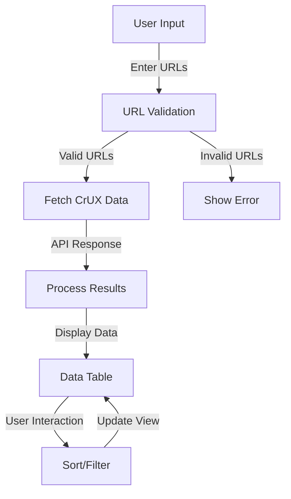

# CrUX Dashboard

A web application that allows users to analyze webpage performance metrics using Google's Chrome User Experience Report (CrUX) data. The application is deployed at [https://crux-frontend-flame.vercel.app/](https://crux-frontend-flame.vercel.app/)

## Features

- Input multiple URLs to analyze their performance metrics
- View key Core Web Vitals metrics:
  - Largest Contentful Paint (LCP)
  - First Contentful Paint (FCP)
  - Cumulative Layout Shift (CLS)
  - Interaction to Next Paint (INP)
  - Time to First Byte (TTFB)
- Sort and filter results
- Toggle visibility of specific metrics
- Filter by URLs
- Hide error results

## Application Flow



## Tech Stack

- **Frontend**: Next.js with TypeScript
- **UI Components**: Material-UI (MUI)
- **Deployment**: Vercel

## Getting Started

### Prerequisites

- Node.js (v14 or higher)
- npm or yarn

### Installation

1. Clone the repository:

```bash
git clone https://github.com/dwivedi-gaurav/crux-frontend.git
cd crux-frontend
```

2. Install dependencies:

```bash
npm install
# or
yarn install
```

3. Run the development server:

```bash
npm run dev
# or
yarn dev
```

4. Open [http://localhost:3000](http://localhost:3000) in your browser.

## Usage

1. Enter one or more URLs in the text area (one URL per line)
2. Click "Fetch CrUX Data" to retrieve performance metrics
3. Use the filters to:
   - Toggle specific metrics
   - Sort by different metrics
   - Filter by URLs
   - Hide error results

## Contributing

Contributions are welcome! Please feel free to submit a Pull Request.

## License

This project is licensed under the MIT License - see the LICENSE file for details.
